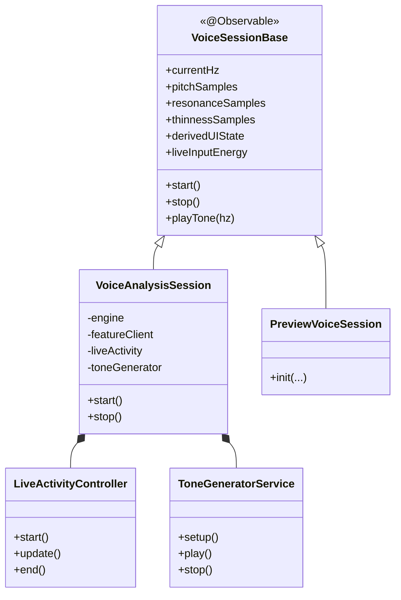
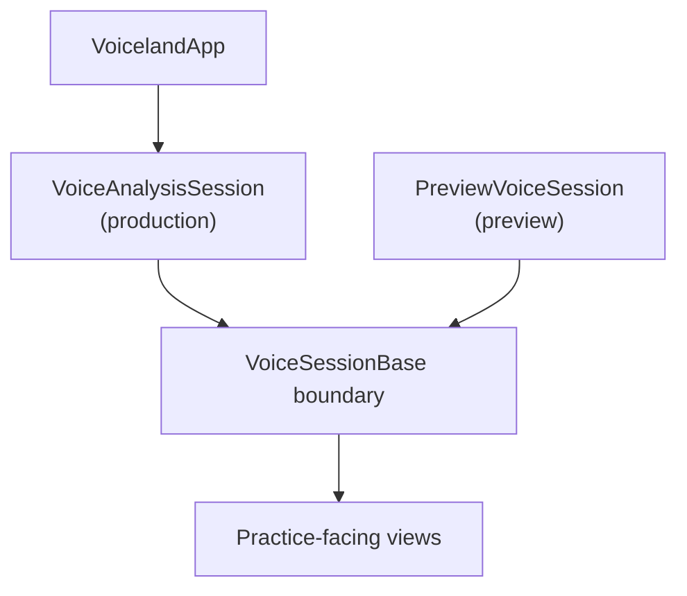

# Voiceland

> Public Showcase

Language: **English** | [繁體中文](README.zh-TW.md) | [简体中文](README.zh-CN.md)

<p align="center">
  
</p>


-0f766e?style=flat-square)


Voiceland is an on-device voice training app for pitch, resonance, vocal weight, and voice exploration.

A calm, supportive iPhone experience for people shaping a voice that feels like their own.

This repository is the public-facing documentation and image layer for Voiceland.

## Overview

- on-device voice practice experience on iPhone
- live feedback across pitch, resonance, vocal weight, and constriction
- architecture-first public overview (without shipping source code)

### Current Status

| Area | Status |
|---|---|
| iPhone app | Active development |
| TestFlight | In preparation |
| Android | Planned |
| Public repo scope | Curated showcase, not full product mirror |

### Brand Lens

Voiceland is not intended to feel like a cold voice lab.

- supportive rather than judgmental
- precise without becoming clinical
- expressive without losing technical credibility

### Tech Stack

| Platform | Stack |
|---|---|
| iOS | Swift, SwiftUI, AVFoundation, Core ML |
| Android (planned) | Kotlin, Jetpack Compose, AudioRecord, TensorFlow Lite |

## Contributors

This showcase reflects the product and engineering work tracked in the main Voiceland repository.

<p align="left">
  <a href="https://github.com/Xanaxxxxxx">
    
  </a>
  <a href="https://github.com/antarfrica">
    
  </a>
</p>

| Contributor | Role | Contact |
|---|---|---|
| [Xana](https://github.com/Xanaxxxxxx) | Lead Developer, HCI & iOS Engineering | `a21147348a@connect.polyu.hk` |
| [Fan Lok Wai](https://github.com/antarfrica) | Research Lead, ML Systems & Voice Science | [GitHub](https://github.com/antarfrica) |

[View contributor history](https://github.com/Xanaxxxxxx/Voiceland/graphs/contributors)

## Architecture

### iOS Architecture Snapshot

The following diagrams are intentionally simplified for public communication.
They describe system structure and responsibilities at a high level.

### Layer overview

```text
┌─────────────────────────────────────────────────────────────────┐
│  Features  (Practice · Learn · Summary · Auth)                 │
│  Screen-level flows and interaction surfaces                   │
├─────────────────────────────────────────────────────────────────┤
│  Shared                                                        │
│  Design language, chart chrome, and reusable UI semantics      │
├─────────────────────────────────────────────────────────────────┤
│  Core                                                          │
│  Domain state, session services, and repository contracts       │
├─────────────────────────────────────────────────────────────────┤
│  System Frameworks                                             │
│  Core ML / AVFoundation / ActivityKit                          │
└─────────────────────────────────────────────────────────────────┘
```

In this structure:

- Features orchestrate user-facing flows and screen state.
- Shared provides design language and reusable presentation semantics.
- Core defines session state boundaries and service responsibilities.
- System frameworks handle hardware/audio access, on-device inference, and live surfaces.

### Session service decomposition



Design intent:

- keep the session state boundary stable for all practice-facing views
- isolate framework-bound concerns into focused services
- support preview/test modes without requiring live microphone input
- preserve clear ownership between state, orchestration, and side-effect services

### Dependency injection model



Operationally, this keeps production and preview entry points aligned while allowing UI work to proceed independently from runtime capture.

### Documentation map

| Document | Purpose |
|---|---|
| `Runtime Interface` section below | explains the public runtime interface |
| `Core ML Boundary` section below | explains where on-device ML sits in runtime |

## Runtime Interface

This section describes the public interface between the app layer and the internal processing layer.
It explains what the app sends, what it gets back, and what guarantees the UI can rely on.

### Public Interface Summary

| Topic | Publicly explained |
|---|---|
| Audio enters as app-shaped input | Yes |
| Processing consumes normalized app-side chunks | Yes |
| Processing emits aligned metric series | Yes |
| Invalid or masked frames can be nullable | Yes |

### Request responsibilities

- microphone capture
- shaping audio into the expected input format
- maintaining stream lifecycle for a live session
- deciding which product-facing metrics to surface

### Response responsibilities

- whether a stream emission occurred
- frame-aligned metric series
- nullable values when a frame should not be surfaced as trustworthy
- lightweight diagnostic metadata suitable for UI decisions

### Stability guarantees

1. The app consumes a stable request/response boundary rather than binding UI directly to model internals.
2. Metric series are frame-aligned and suitable for charting or live feedback.
3. Processing can adapt output quality handling for live UX stability.

## Core ML Boundary

This section explains where on-device ML sits in the runtime and where it does not.
The goal is to make architecture understandable in product terms.

### Boundary summary

| Layer | Responsibility |
|---|---|
| Swift app runtime | audio capture, stream lifecycle, UI state |
| App-side preprocessing | converts live input into a model-ready representation |
| On-device ML model | transforms that representation into a compact intermediate output |
| App-side postprocessing | turns model output into UI-facing metrics and suppresses unreliable frames |
| SwiftUI | renders the result for live training feedback |

### What the model does

- receives an app-prepared input representation
- emits a compact intermediate output
- app transforms output into the product metrics shown in UI

### What stays outside the model

- microphone and audio session control
- stream buffering
- session reset semantics
- UI-facing metric selection
- UI-facing masking behavior
- chart rendering and state observation

## Getting Started

| If you want to see... | Open |
|---|---|
| Runtime interface | `Runtime Interface` section above |
| On-device ML boundary | `Core ML Boundary` section above |
| Main security policy | [Voiceland/docs/security-audit.md](https://github.com/Xanaxxxxxx/Voiceland/blob/main/docs/security-audit.md) |
| Main repository | [Voiceland main repository](https://github.com/Xanaxxxxxx/Voiceland) |

## Repository Contents

| Area | Included now |
|---|---|
| Docs | architecture, runtime interface, and on-device ML boundary |
| Images | brand and curated public-safe media assets |

## Repo Layout

```text
voiceland-showcase/
├── README.md
├── LICENSE
└── Media/
```

## Why This Repo Exists

Voiceland is a product where trust matters. This repo exists to communicate product direction, architecture boundaries, and design intent.
