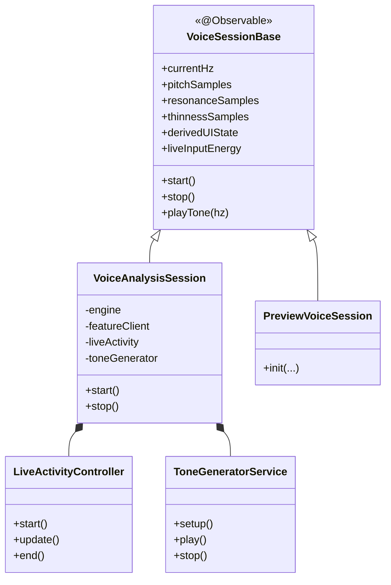
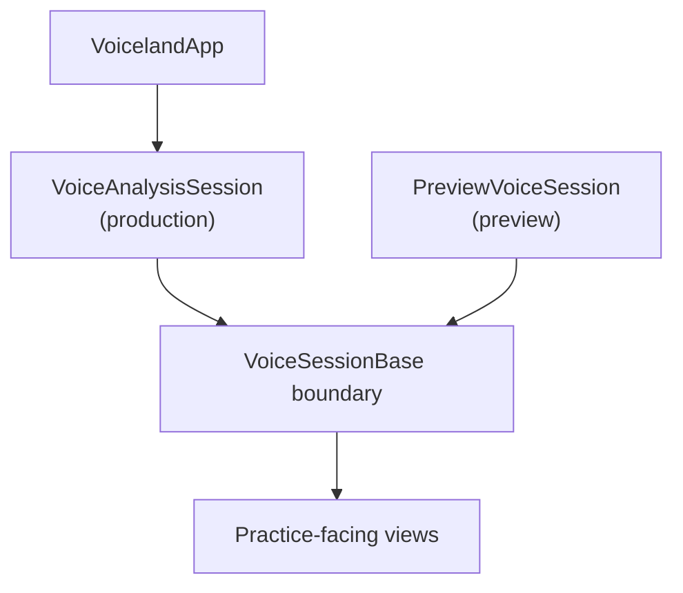

# Voiceland

> Public Showcase

Language: [English](README.md) | [繁體中文](README.zh-TW.md) | **简体中文**

<p align="center">
  
</p>


-0f766e?style=flat-square)


Voiceland 是一款以 iPhone 为核心、在设备端运行的声音训练产品，聚焦于 pitch、resonance、vocal weight 与 constriction 的实时反馈。

这个仓库是 Voiceland 的公开展示层，重点放在产品方向、架构边界与设计语言。

## 概览

- iPhone 端设备内声音练习体验
- 实时反馈覆盖 pitch、resonance、vocal weight 与 constriction
- 以架构说明为核心的公开展示（不提供可直接运行的产品源码）

### 当前状态

| 项目 | 状态 |
|---|---|
| iPhone app | 持续开发中 |
| TestFlight | 准备中 |
| Android | 规划中 |
| 公开仓库范围 | 展示用途，不是完整产品镜像 |

### 品牌方向

- 更强调支持感，而不是纠错感
- 保持专业与精准，但不过度实验室化
- 兼顾表达体验与技术可信度

### 技术栈

| 平台 | 技术栈 |
|---|---|
| iOS | Swift, SwiftUI, AVFoundation, Core ML |
| Android（规划中） | Kotlin, Jetpack Compose, AudioRecord, TensorFlow Lite |

## 贡献者

本展示仓库反映主仓库中的产品与工程协作。

<p align="left">
  <a href="https://github.com/Xanaxxxxxx">
    
  </a>
  <a href="https://github.com/antarfrica">
    
  </a>
</p>

| 贡献者 | 角色 | 联系方式 |
|---|---|---|
| [Xana](https://github.com/Xanaxxxxxx) | Lead Developer, HCI & iOS Engineering | `a21147348a@connect.polyu.hk` |
| [Fan Lok Wai](https://github.com/antarfrica) | Research Lead, ML Systems & Voice Science | [GitHub](https://github.com/antarfrica) |

[查看贡献记录](https://github.com/Xanaxxxxxx/Voiceland/graphs/contributors)

## 架构

### iOS 架构快照

以下图示为公开展示用途的简化版本，用于说明结构与职责分工。

#### 分层概览

```text
┌─────────────────────────────────────────────────────────────────┐
│  Features  (Practice · Learn · Summary · Auth)                 │
│  Screen-level flows and interaction surfaces                   │
├─────────────────────────────────────────────────────────────────┤
│  Shared                                                        │
│  Design language, chart chrome, and reusable UI semantics      │
├─────────────────────────────────────────────────────────────────┤
│  Core                                                          │
│  Domain state, session services, and repository contracts       │
├─────────────────────────────────────────────────────────────────┤
│  System Frameworks                                             │
│  Core ML / AVFoundation / ActivityKit                          │
└─────────────────────────────────────────────────────────────────┘
```

#### Session 服务拆分



#### 依赖注入模型



## 快速开始

| 想看什么 | 位置 |
|---|---|
| Runtime 接口 | `Runtime Interface` 章节 |
| Core ML 边界 | `Core ML Boundary` 章节 |
| 安全与发布规范（主仓库单一来源） | [Voiceland/docs/security-audit.md](https://github.com/Xanaxxxxxx/Voiceland/blob/main/docs/security-audit.md) |
| 主仓库 | [Voiceland main repository](https://github.com/Xanaxxxxxx/Voiceland) |

## 仓库结构

```text
voiceland-showcase/
├── README.md
├── README.zh-TW.md
├── README.zh-CN.md
├── LICENSE
└── Media/
```
