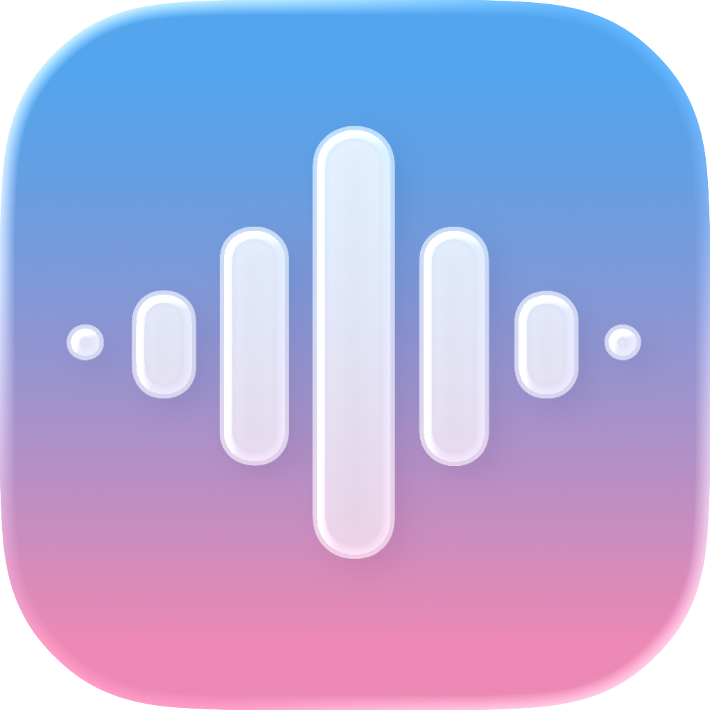
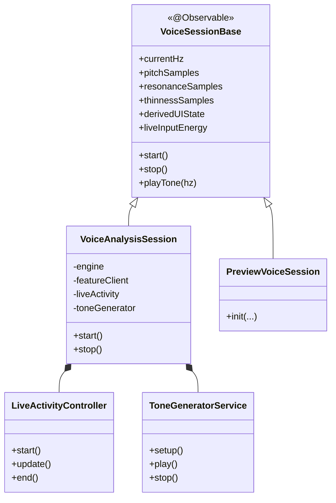
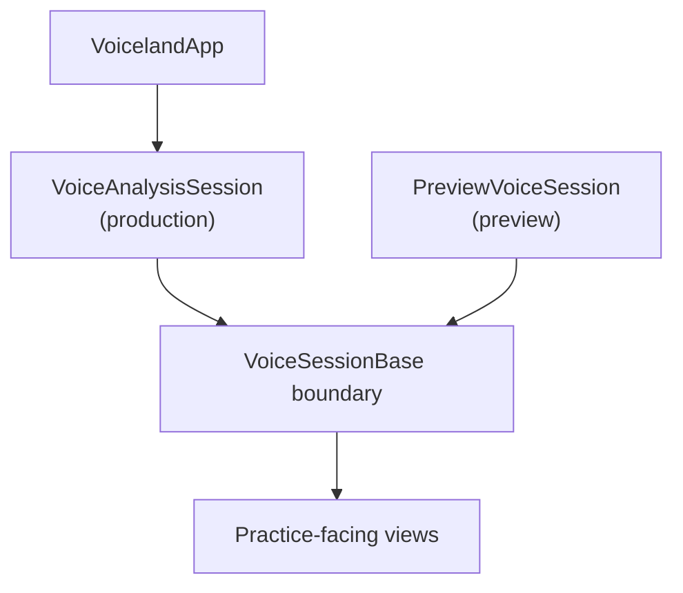

# Voiceland

> Public Showcase

Language: [English](README.md) | **繁體中文** | [简体中文](README.zh-CN.md)

<p align="center">
  
</p>


-0f766e?style=flat-square)


Voiceland 是一款以 iPhone 為核心、在裝置端運行的聲音訓練產品，聚焦於 pitch、resonance、vocal weight 與 constriction 的即時回饋。

這個倉庫是 Voiceland 的公開展示層，重點放在產品方向、架構邊界與設計語言。

## 概覽

- iPhone 裝置端聲音練習體驗
- 即時回饋涵蓋 pitch、resonance、vocal weight 與 constriction
- 以架構說明為核心的公開展示（不提供可直接運行的產品程式碼）

### 目前狀態

| 項目 | 狀態 |
|---|---|
| iPhone app | 持續開發中 |
| TestFlight | 準備中 |
| Android | 規劃中 |
| 公開倉庫範圍 | 展示用途，不是完整產品鏡像 |

### 品牌方向

- 支持感優先，而不是糾錯感優先
- 保持精準，但不走臨床化語氣
- 兼顧表達感與技術可信度

### 技術棧

| 平台 | 技術棧 |
|---|---|
| iOS | Swift, SwiftUI, AVFoundation, Core ML |
| Android（規劃中） | Kotlin, Jetpack Compose, AudioRecord, TensorFlow Lite |

## 貢獻者

此展示倉庫反映主倉庫中的產品與工程協作。

<p align="left">
  <a href="https://github.com/Xanaxxxxxx">
    
  </a>
  <a href="https://github.com/antarfrica">
    
  </a>
</p>

| 貢獻者 | 角色 | 聯絡方式 |
|---|---|---|
| [Xana](https://github.com/Xanaxxxxxx) | Lead Developer, HCI & iOS Engineering | `a21147348a@connect.polyu.hk` |
| [Fan Lok Wai](https://github.com/antarfrica) | Research Lead, ML Systems & Voice Science | [GitHub](https://github.com/antarfrica) |

[查看貢獻紀錄](https://github.com/Xanaxxxxxx/Voiceland/graphs/contributors)

## 架構

### iOS 架構快照

以下圖示為公開展示用途的簡化版本，用於說明結構與責任分工。

#### 層級概覽

```text
┌─────────────────────────────────────────────────────────────────┐
│  Features  (Practice · Learn · Summary · Auth)                 │
│  Screen-level flows and interaction surfaces                   │
├─────────────────────────────────────────────────────────────────┤
│  Shared                                                        │
│  Design language, chart chrome, and reusable UI semantics      │
├─────────────────────────────────────────────────────────────────┤
│  Core                                                          │
│  Domain state, session services, and repository contracts       │
├─────────────────────────────────────────────────────────────────┤
│  System Frameworks                                             │
│  Core ML / AVFoundation / ActivityKit                          │
└─────────────────────────────────────────────────────────────────┘
```

#### Session 服務拆分



#### 依賴注入模型



## 快速開始

| 想看什麼 | 位置 |
|---|---|
| Runtime 介面 | `Runtime Interface` 章節 |
| Core ML 邊界 | `Core ML Boundary` 章節 |
| 安全與發布規範（主倉庫單一來源） | [Voiceland/docs/security-audit.md](https://github.com/Xanaxxxxxx/Voiceland/blob/main/docs/security-audit.md) |
| 主倉庫 | [Voiceland main repository](https://github.com/Xanaxxxxxx/Voiceland) |

## 倉庫結構

```text
voiceland-showcase/
├── README.md
├── README.zh-TW.md
├── README.zh-CN.md
├── LICENSE
└── Media/
```
